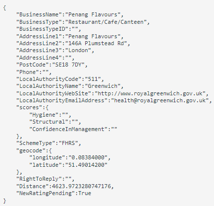

# nosql-challenge
Columbia University Bootcamp Module 12 Challenge

**Background**

The UK Food Standards Agency evaluates various establishments across the United Kingdom, and gives them a food hygiene rating.

You've been contracted by the editors of a food magazine, Eat Safe, Love, to evaluate some of the ratings data in order to help their journalists and food critics decide where to focus future articles.

**Instructions**

_**Part 1: Database and Jupyter Notebook Set Up**_

Use <b>NoSQL_setup_starter.ipynb</b> for this section of the challenge.

<ol>
    <li>
    Import the data provided in the <b>establishments.json</b> file from your Terminal. Name the database <b>uk_food</b> and the collection <b>establishments</b>. Copy the text you used to import your data from your Terminal to a markdown cell in your notebook.
    </li>
    <li>
    Within your notebook, import the libraries you need: PyMongo and Pretty Print (<b>pprint</b>).
    </li>
    <li>
    Create an instance of the Mongo Client.
    </li>
    <li>
    Confirm that you created the database and loaded the data properly:
        <ul>
            <li>
            List the databases you have in MongoDB. Confirm that <b>uk_food</b> is listed.
            </li>
            <li>
            List the collection(s) in the database to ensure that <b>establishments</b> is there.
            </li>
            <li>
            Find and display one document in the <b>establishments</b> collection using <b>find_one</b> and display with <b>pprint</b>.
            </li>
        </ul>
    <li>
    Assign the <b>establishments</b> collection to a variable to prepare the collection for use.
    </li>
</ol>

_**Part 2: Update the Database**_

Use NoSQL_setup_starter.ipynb for this section of the challenge.

The magazine editors have some requested modifications for the database before you can perform any queries or analysis for them. Make the following changes to the establishments collection:

<ol>
    <li>
    An exciting new halal restaurant just opened in Greenwich, but hasn't been rated yet. The magazine has asked you to include it in your analysis. Add the following information to the database:
    </li>
    

            
    

    <li>
    Find the BusinessTypeID for "Restaurant/Cafe/Canteen" and return only the <b>BusinessTypeID</b> and <b>BusinessType</b> fields.
    </li>
    <li>
    Update the new restaurant with the <b>BusinessTypeID</b> you found.
    </li>
    <li>
    The magazine is not interested in any establishments in Dover, so check how many documents contain the Dover Local Authority. Then, remove any establishments within the Dover Local Authority from the database, and check the number of documents to ensure they were deleted.
    </li>
    <li>
    Some of the number values are stored as strings, when they should be stored as numbers.
        <ul>
            <li>
            Use update_many to convert latitude and longitude to decimal numbers.
            </li>
            <li>
            Use update_many to convert RatingValue to integer numbers.
            </li>
        </ul>
    </li>
</ol>

_**Part 3: Exploratory Analysis**_

Eat Safe, Love has specific questions they want you to answer, which will help them find the locations they wish to visit and avoid.

Use <b>NoSQL_analysis_starter.ipynb</b> for this section of the challenge.

Some notes to be aware of while you are exploring the dataset:

<ul>
    <li>
    <b>RatingValue</b> refers to the overall rating decided by the Food Authority and ranges from 1-5. The higher the value, the better the rating.
    </li>
        <ul>
            <li>
            <b>Note:</b> This field also includes non-numeric values such as 'Pass', where 'Pass' means that the establishment passed their inspection but isn't given a number rating. We will coerce non-numeric values to nulls during the database setup before converting ratings to integers.
            </li>
        </ul>
    <li>
    The scores for Hygiene, Structural, and ConfidenceInManagement work in reverse. This means, the higher the value, the worse the establishment is in these areas.
    </li>
</ul>

Use the following questions to explore the database, and find the answers, so you can provide them to the magazine editors.

Unless otherwise stated, for each question:

<ul>
    <li>
    Use <b>count_documents</b> to display the number of documents contained in the result.
    </li>
    <li>
    Display the first document in the results using <b>pprint</b>.
    </li>
    <li>
    Convert the result to a Pandas DataFrame, print the number of rows in the DataFrame, and display the first 10 rows.
    </li>
</ul>
<ol>
    <li>
    Which establishments have a hygiene score equal to 20?
    </li>
    <li>
    Which establishments in London have a <b>RatingValue</b> greater than or equal to 4?
    </li>
    <li>
    What are the top 5 establishments with a <b>RatingValue</b> of 5, sorted by lowest hygiene score, nearest to the new restaurant added, "Penang Flavours"?
    </li>
    <li>
    How many establishments in each Local Authority area have a hygiene score of 0? Sort the results from highest to lowest, and print out the top ten local authority areas.
    </li>
</ol>
